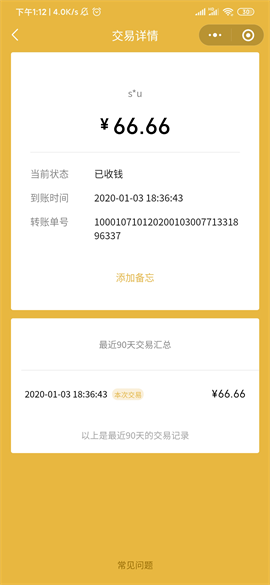
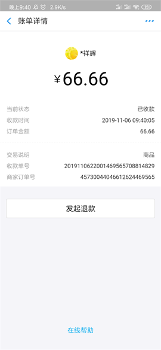
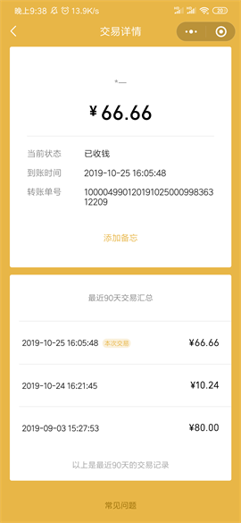
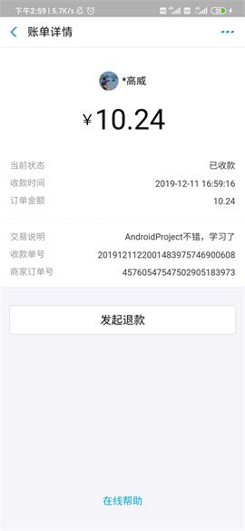
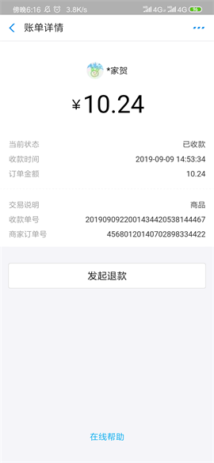
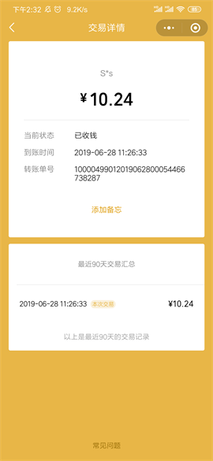
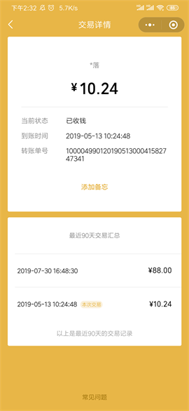
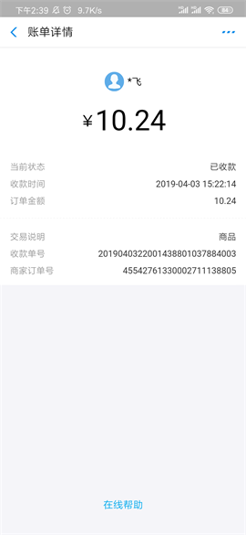

* 码云地址：[Gitee](https://gitee.com/getActivity/Donate)

#### 常用疑问解答

* 轮子哥开源能挣钱吗？

> 我如果拿开源的时间去加班，现在挣到的远远不止这些。

* 轮子哥你为何如此优秀？

> 全年无休你也可以这么优秀，就看你愿不愿意接受这个事实。

* 轮子哥你平时都是怎么学习的？

> 我的学习是没有目标的，看到什么不会学什么，但我暂时只学习安卓这个领域相关的知识。

* 轮子哥我怎么问你问题老是不会啊？

> 说实话我要是会的话也愿意给大家一些思路，不瞒大家我一直在知识深度上面追逐，所以在知识广度这块有所欠缺，这个是我的一个短板，后续会补上。

* 轮子哥能不能教我造轮子？

> 我说一下自己平时怎么写框架的代码，我每天 review 代码所花费的时间远远超过写代码所花的时间，改的代码行也远远超过现有代码行数，平均下来一行代码改动将近十次，这些改动有些来自前辈们的提醒，有些是自我纠正，最终只有那十分之一的代码更新到了 Github 上面。

* 轮子哥如何才能算做好一个框架？

> 做一个框架最多只要一个星期，但是要做好一个框架可能要将近一年甚至几年的时间不断改进和维护，这期间每天都会有不同的麻烦找上你，最后解决了问题可能连一句谢谢都没有，现在 Github 上面超过 99 % 的框架都已经没有继续维护下去了，你要成为那不到 1% 的人可以，但是会很难。

* 轮子哥你能谈谈对开源的看法吗？

> 如果说在公司写代码是我们的职责，那么开源便是一种义务。喝水不忘挖井人，如果我们有这个能力了，要多去帮助别人，仅凭我一人之力很难去推动和改变，我顶多算帮大家开了个好头，开源最终还是要靠大家的共同努力。

#### 开源项目列表

* 安卓技术中台：[AndroidProject](https://github.com/getActivity/AndroidProject)  

* 网络框架：[EasyHttp](https://github.com/getActivity/EasyHttp)  

* 吐司框架：[ToastUtils](https://github.com/getActivity/ToastUtils)  

* 权限框架：[XXPermissions](https://github.com/getActivity/XXPermissions)  

* 标题栏框架：[TitleBar](https://github.com/getActivity/TitleBar)  

* 悬浮窗框架：[XToast](https://github.com/getActivity/XToast)  

* 国际化框架：[MultiLanguages](https://github.com/getActivity/MultiLanguages)  

* Gson 解析容错：[GsonFactory](https://github.com/getActivity/GsonFactory)  

* 日志查看框架：[Logcat](https://github.com/getActivity/Logcat)  

* 表情包集合：[EmojiPackage](https://github.com/getActivity/EmojiPackage)  

* 省市区数据：[ProvinceJson](https://github.com/getActivity/ProvinceJson)  

* Studio 精品插件：[StudioPlugins](https://github.com/getActivity/StudioPlugins)  

* Android 代码规范：[StudioPlugins](https://github.com/getActivity/AndroidCodeStandard)  

#### Android技术讨论Q群：78797078

#### 微信公众号：Android轮子哥


#### 如果您觉得我的开源库帮你节省了大量的开发时间，请扫描下方的二维码随意打赏，要是能打赏个 10.24 :monkey_face:就太:thumbsup:了。您的支持将鼓励我继续创作:octocat:

 

#### 感谢支持

                                                                                                                                                         

## License

```text
Copyright 2019 Huang JinQun

Licensed under the Apache License, Version 2.0 (the "License");
you may not use this file except in compliance with the License.
You may obtain a copy of the License at

   http://www.apache.org/licenses/LICENSE-2.0

Unless required by applicable law or agreed to in writing, software
distributed under the License is distributed on an "AS IS" BASIS,
WITHOUT WARRANTIES OR CONDITIONS OF ANY KIND, either express or implied.
See the License for the specific language governing permissions and
limitations under the License.
```